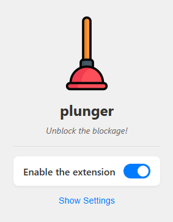

#  Plunger

> NB - Google recently (June 2025) changed how ad blocking works on Youtube - aggressively monitoring and reverting programmatic changes to the DOM. As such the current version (1.0.1) of this extension may not work correctly until a workaround/update. Apologies for any inconvenience. 

## The Youtube Adblock Blockage Remover

Plunger is a browser extension designed to enhance your YouTube viewing by eliminating the interruptions caused by adblock detectors.

It works in Chrome*, Firefox and Edge browsers and can be added directly through their respective stores. 

  

_*It may also work on other Chromium based browsers (Opera, Vivaldi, Brave, etc) that allow Chrome extensions, however these are untested and are not offically supported by this project._

## How Plunger Enhances Your Viewing

Plunger is really just an adblock blocker workaround – it's an innovative solution that switches YouTube's default player to the embedded version, typically used for sharing. This clever alteration allows you to enjoy videos seamlessly, even with adblock enabled and while being logged into your account.

## Features at a Glance:

* Bypass Ad-Block Detectors: Plunger deals with ad-block detectors like a charm, letting you get to the good part without a wait.
* Privacy-Friendly Viewing: Can be set to use 'youtube-nocookie.com' - although some videos may not work with this setting.
* Discreet and Efficient: Does the job quietly and efficiently, with no drama.

## Easy to Use:

Plunger is a no-fuss, install-and-forget kind of extension. It works quietly behind the scenes, keeping your YouTube experience clean and smooth. Should you wish to tweak the settings for autoplay, privacy, language, etc a simple options menu is available.

## Settings

# 

### Automatically play videos

This parameter specifies whether the initial video will automatically start to play when the player loads.

*   `off` (default) playback will not automatically start
*   `on` playback will automatically start

### Enable privacy-enhanced mode

This parameter specifies whether privacy-enhanced mode is used.

*   `off` (default) player will use `www.youtube.com`
*   `on` player will use `www.youtube-nocookie.com`

### Show closed captions

This parameter specifies whether closed captions are displayed, however it only works for custom closed captions, not for auto generated ones.

*   `off` (default) Closed captions are not shown.
*   `on` Closed captions are shown.

### Show video annotations

This parameter specifies whether video annotations are displayed:

*   `off` Video annotations are not shown.
*   `on` (default) Video annotations are shown.

### Display player controls

This parameter specifies whether the video player controls are displayed:

*   `off` Player controls do not display in the player.
*   `on` (default) Player controls display in the player.

### Display fullscreen button

This parameter specifies whether the fullscreen button is displayed in the player. The default value is `1`, which causes the fullscreen button to display.

*   `off` The fullscreen button is hidden
*   `on` (default) The fullscreen button is displayed

### Disable keyboard controls

This parameter specifies whether the player will respond to keyboard controls.

*   `off` (default) Keyboard controls are enabled
*   `on` Keyboard controls are disabled

**Supported keyboard controls:**

*   <kbd>Spacebar</kbd> or <kbd>k</kbd>: Play / Pause
*   <kbd>←</kbd>: Jump back 5 seconds in the current video
*   <kbd>→</kbd>: Jump ahead 5 seconds in the current video
*   <kbd>↑</kbd>: Volume up
*   <kbd>↓</kbd>: Volume Down
*   <kbd>f</kbd>: Toggle full-screen display
*   <kbd>j</kbd>: Jump back 10 seconds in the current video
*   <kbd>l</kbd>: Jump ahead 10 seconds in the current video
*   <kbd>m</kbd>: Mute or unmute the video
*   <kbd>0</kbd>-<kbd>9</kbd>: Jump to a point in the video. <kbd>0</kbd> jumps to the beginning of the video, <kbd>1</kbd> jumps to the point 10% into the video, <kbd>2</kbd> jumps to the point 20% into the video, and so forth.

### Loop video/playlist

This parameter specifies whether the player should play the video repeatedly
In the case of a playlist the player plays the entire playlist and then starts again at the first video.  
 
*   `off` (default) Don't loop the video/playlist
*   `on` Loop the video/playlist

### Generic related videos

This parameter specifies if related videos will come from the same channel or be generic.
 
*   `off` (default) related videos will come from the same channel as the video that was just played.
*   `on` Related videos will be more general

### Interface language

This parameter specifies the player's interface language.

The parameter value is an [ISO 639-1 two-letter language code](http://www.loc.gov/standards/iso639-2/php/code_list.php) or a fully specified locale. For example, `fr` and `fr-ca` are both valid values. Other language input codes, such as IETF language tags (BCP 47) might also be handled properly.  
 
The interface language is used for tooltips in the player and also affects the default caption track. Note that YouTube might select a different caption track language for a particular user based on the user's individual language preferences and the availability of caption tracks.

*   `en` (default) Use English

## Installation

### Chrome

Alternatively...

1) Clone the `plunger` repository
2) Go to `chrome://extensions/`
3) Turn on "Developer Mode"
4) Choose "Load unpacked extension"
5) select the `src` directory inside the `plunger` directory you downloaded in step one.

### Firefox

Alternatively...

1) Clone the `plunger` repository
2) Go to `about:debugging`
3) Click on "This Firefox"
4) Choose "Load Temporary Add-on…"
5) Select the `manifest.json` file in the `plunger/src` directory you downloaded in step one.

### Edge 

Alternatively...

1) Clone the `plunger` repository
2) Go to `edge://extensions/`
3) Turn on "Developer Mode"
4) Choose "Load unpacked"
5) select the `src` directory inside the `plunger` directory you downloaded in step one.

## Example in action

## Contributing

If you want to contribute and make it even better, feel free to fork the repository and submit a pull request. Your contributions are always welcome!
